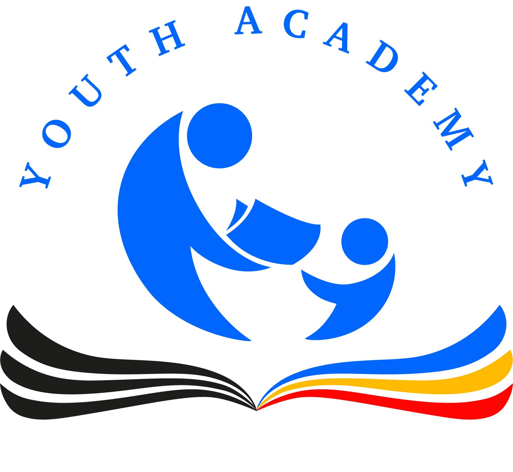

# Free Education accessibility

## About Us

Youth Academy is a platform that provides education services for free to help improve the quality of education in various worlds in an effort to build public awareness and concern for educational issues. Youth academy also tries to attract people to learn about educational problems by combining easy-to-use technology with relevant content to create a fun experience of the learning process.

### Mission:

Youth academy aims to be the leader in online learning by delivering high-quality education that are accessible and acceptable for all of people.

### Vision:

To improves people’s lives and increasing the human resources competitiveness

### Goal:

Youth academy is a platform that makes students and teachers interaction more effective and efficient. Youth academy helps all people succeed in their learning journey

### Why it called Youth Academy?

Because we want to encourage everybody to raise the spirit of young learning. Usually, old people are reluctant to learn something new. Therefore, through Youth Academy it is expected that all communities both old, young, rich, and poor raise their young spirit in order to have willingness to keep learning
Why do we do, what we do?
This means we can’t continue to learn the same way like we always did.
In the end, Youth Academy wants to prepare our future generations of students and people to enter the world with qualifications and open doors in the 21st century.

### The Solution

Provide the education as a web application in the cloud. The Student could get an individual plan for their study carrier. At the end of their study they will get a certification, which give them the opportunity to get to the university.

